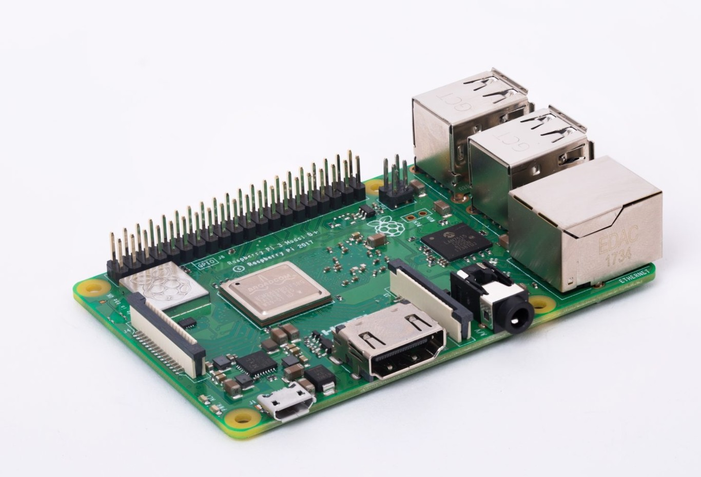
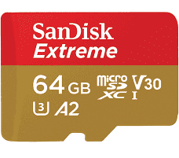
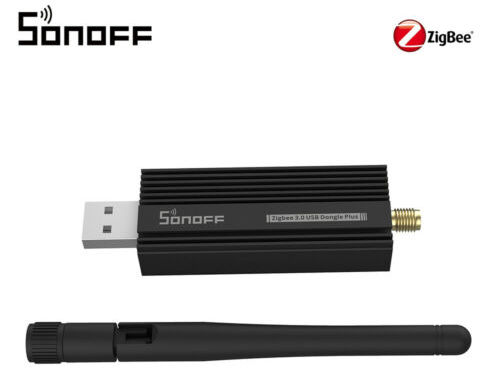
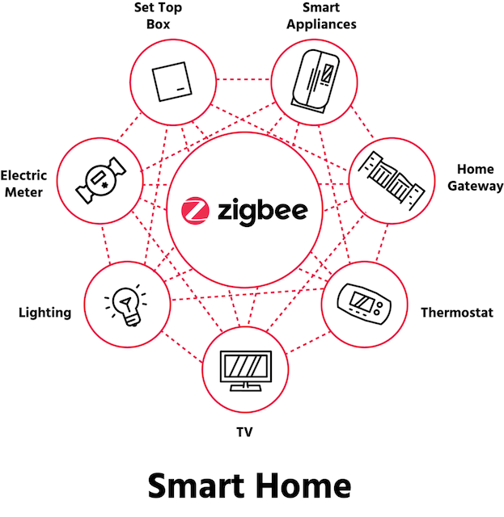
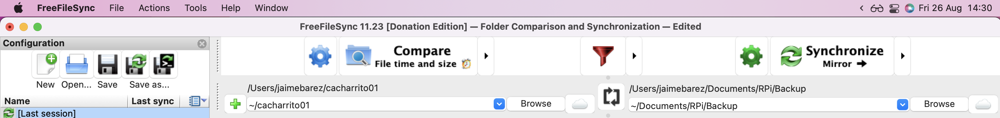

# Open Source Smart Home - Raspberry Pi, Home Assistant, Zigbee

In this tutorial, we will be  setting up a Smart Home in my Raspberry Pi, following the best practices.

This will let us do home automations, like turning on/off lights depending on some scenarios. We will also have dashboards to visualize parameters like temperature, humidity, etc.

We will be migrating my previous home-assistant configuration into a new SD card with the Raspberry Operating System updated, following the best practices for security, usability and maintainability. 
This previous system is outdated, and I did not take notes on the configurations and stepsdone, this is why this tutorial was made: I need to be able to maintain and upgrade the system easily in the future.

## Hardware needed
### Raspberry Pi Model 3B+  

  
[https://www.raspberrypi.com/products/raspberry-pi-3-model-b-plus/](https://www.raspberrypi.com/products/raspberry-pi-3-model-b-plus/) 

*The Raspberry Pi is a low cost, credit-card sized computer that plugs into a computer monitor or TV, and uses a standard keyboard and mouse. It is a capable little device that enables people of all ages to explore computing, and to learn how to program in languages like Scratch and Python. It’s capable of doing everything you’d expect a desktop computer to do, from browsing the internet and playing high-definition video, to making spreadsheets, word-processing, and playing games.*  

*What’s more, the Raspberry Pi  has the ability to interact with the outside world, and has been used in a wide array of digital maker projects, from music machines and parent detectors to weather stations and tweeting birdhouses with infra-red cameras. We want to see the Raspberry Pi being used by kids all over the world to learn to program and understand how computers work.*

### MicroSD Card
  

Here, the Operating System and configuration files will be stored.

Following [home assistant recommendations](https://www.home-assistant.io/installation/raspberrypi/) we will be using SanDisk Extreme - Memory Card microSDXC 64 GB, A2, Class 10, U3, V30. 


### SONOFF Zigbee 3.0 USB Dongle  
  
[https://sonoff.tech/product/diy-smart-switch/sonoff-zigbee-dongle-plus-efr32mg21/](https://sonoff.tech/product/diy-smart-switch/sonoff-zigbee-dongle-plus-efr32mg21/)

*SONOFF Zigbee 3.0 USB Dongle is a universal Zigbee USB stick. It can be used as a universal Zigbee gateway in Home Assistant or other open-source platforms via ZHA or Zigbee2MQTT to locally control all your Zigbee sub-devices, so you don’t need to invest on the Zigbee hubs for different brands, all you need is a universal gateway – Dongle Plus!*

#### About Zigbee
  

*Zigbee is an IEEE 802.15.4-based specification for a suite of high-level communication protocols used to create personal area networks with small, low-power digital radios, such as for home automation, medical device data collection, and other low-power low-bandwidth needs, designed for small scale projects which need wireless connection. Hence, Zigbee is a low-power, low data rate, and close proximity (i.e., personal area) wireless ad hoc network.*  

*Its low power consumption limits transmission distances to 10–100 meters line-of-sight, depending on power output and environmental characteristics.[1] Zigbee devices can transmit data over long distances by passing data through a mesh network of intermediate devices to reach more distant ones. Zigbee is typically used in low data rate applications that require long battery life and secure networking. (Zigbee networks are secured by 128 bit symmetric encryption keys.) Zigbee has a defined rate of 250 kbit/s, best suited for intermittent data transmissions from a sensor or input device.*

## Setting up
### Back up
I did back up our old files from the raspberry to my mac.
The old raspberry hostname is cacharrito01, spanish for "little_gadget_01".

Mounting root "/" from raspberry into `$HOME/cacharrito01` on my mac:

```console
ssh_port="6996"
rpi_name="cacharrito01.local"
sudo sshfs -p "${ssh_port}" \  
           -o allow_other,defer_permissions \
           "root@${rpi_name}":/ \
           "$HOME/cacharrito01"
```

After mounting, we use [FreeFileSync Donation Edition](https://freefilesync.org/) to copy files locally.
  

```console
# Show mounted files:
mount
# Umounting:
sudo umount "$HOME/cacharrito01"
```

### Install Operating System.

* Mount MicroSD card on the computer
* Install Raspberry Pi Imager `brew install --cask raspberry-pi-imager`
* 


