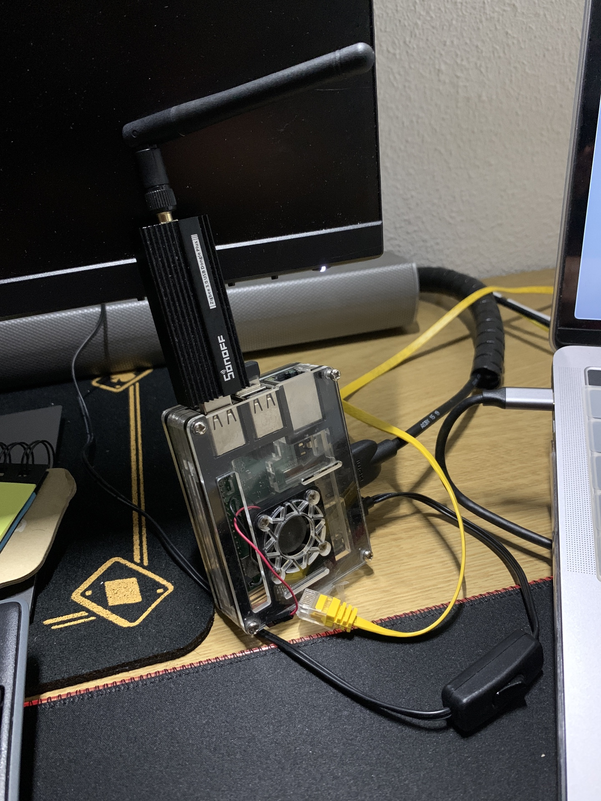

# Open Source Smart Home - Raspberry Pi, Home Assistant, Zigbee

In this tutorial, we will be  setting up a Smart Home in my Raspberry Pi, following the best practices.

This will let us do home automations, like turning on/off lights depending on some scenarios. We will also have dashboards to visualize parameters like temperature, humidity, etc.

We will be migrating my previous home-assistant configuration into a new SD card with the Raspberry Operating System updated, following the best practices for security, usability and maintainability. 
This previous system is outdated, and I did not take notes on the configurations and stepsdone, this is why this tutorial was made: I need to be able to maintain and upgrade the system easily in the future.

## Hardware needed
### Raspberry Pi Model 3B+  

  
[https://www.raspberrypi.com/products/raspberry-pi-3-model-b-plus/](https://www.raspberrypi.com/products/raspberry-pi-3-model-b-plus/) 

*The Raspberry Pi is a low cost, credit-card sized computer that plugs into a computer monitor or TV, and uses a standard keyboard and mouse. It is a capable little device that enables people of all ages to explore computing, and to learn how to program in languages like Scratch and Python. It’s capable of doing everything you’d expect a desktop computer to do, from browsing the internet and playing high-definition video, to making spreadsheets, word-processing, and playing games.*  

*What’s more, the Raspberry Pi  has the ability to interact with the outside world, and has been used in a wide array of digital maker projects, from music machines and parent detectors to weather stations and tweeting birdhouses with infra-red cameras. We want to see the Raspberry Pi being used by kids all over the world to learn to program and understand how computers work.*

### MicroSD Card
  

Here, the Operating System and configuration files will be stored.

Following [home assistant recommendations](https://www.home-assistant.io/installation/raspberrypi/) we will be using SanDisk Extreme - Memory Card microSDXC 64 GB, A2, Class 10, U3, V30. 


### SONOFF Zigbee 3.0 USB Dongle  
  
[https://sonoff.tech/product/diy-smart-switch/sonoff-zigbee-dongle-plus-efr32mg21/](https://sonoff.tech/product/diy-smart-switch/sonoff-zigbee-dongle-plus-efr32mg21/)

*SONOFF Zigbee 3.0 USB Dongle is a universal Zigbee USB stick. It can be used as a universal Zigbee gateway in Home Assistant or other open-source platforms via ZHA or Zigbee2MQTT to locally control all your Zigbee sub-devices, so you don’t need to invest on the Zigbee hubs for different brands, all you need is a universal gateway – Dongle Plus!*

#### About Zigbee
  

*Zigbee is an IEEE 802.15.4-based specification for a suite of high-level communication protocols used to create personal area networks with small, low-power digital radios, such as for home automation, medical device data collection, and other low-power low-bandwidth needs, designed for small scale projects which need wireless connection. Hence, Zigbee is a low-power, low data rate, and close proximity (i.e., personal area) wireless ad hoc network.*  

*Its low power consumption limits transmission distances to 10–100 meters line-of-sight, depending on power output and environmental characteristics.[1] Zigbee devices can transmit data over long distances by passing data through a mesh network of intermediate devices to reach more distant ones. Zigbee is typically used in low data rate applications that require long battery life and secure networking. (Zigbee networks are secured by 128 bit symmetric encryption keys.) Zigbee has a defined rate of 250 kbit/s, best suited for intermittent data transmissions from a sensor or input device.*

## Setting up
### Back up
I did back up our old files from the raspberry to my mac.
The old raspberry hostname is cacharrito01, spanish for "little_gadget_01".

Mounting root "/" from raspberry into `$HOME/cacharrito01` on my mac:

```console
ssh_port="6996"
rpi_name_short="cacharrito01"
rpi_name="${rpi_name_short}.local"
sudo sshfs -p "${ssh_port}" \
           -o allow_other,defer_permissions \
           "jabato@${rpi_name}":/ \
           "${HOME}/${rpi_name_short}"
```

After mounting, we use [FreeFileSync Donation Edition](https://freefilesync.org/) to copy files locally.
  

```console
# Show mounted files:
mount
# Umounting:
sudo umount "$HOME/cacharrito01"
```

### Install Operating System.

* Mount MicroSD card on the computer
* Install Raspberry Pi Imager `brew install --cask raspberry-pi-imager`
* `open "/Applications/Raspberry Pi Imager.app"`


* Insert the SD card into Raspberry Pi SD Card Reader
* Plug USBKeyboard/Mouse and Zigbee Dongle(In my case, wireless)
* (I also connected the HDMI port to my screen to check everything went OK)
* (Keep the eth0 port disconnected so wifi can be set on first boot).
* Turn it on!



* `ssh jabato@cacharrito02.local`

```bash
# Raspberry
sudo apt update
sudo apt full-upgrade
cat /proc/cpuinfo | grep Model
#Model		: Raspberry Pi 3 Model B Plus Rev 1.3
```
[Security Tips](https://raspberrytips.com/security-tips-raspberry-pi/)

1. Keep your system updated
```bash
# Raspberry
sudo apt install unattended-upgrades 
sudo apt install -y vim
# sudo vim /etc/apt/apt.conf.d/50unattended-upgrades
# Set to receive local user root mail upgrades:
# Unattended-Upgrade::Mail "root";
```
For dev purposes I will mount it's filesystem:

```bash
# Local terminal:
rpi_name_short="cacharrito02"
rpi_name="${rpi_name_short}.local"
sudo sshfs -p "${ssh_port}" \
           -o allow_other,defer_permissions \
           "jabato@${rpi_name}":/ \
           "${HOME}/${rpi_name_short}"
# Open finder here           
open /Users/jaimebarez/cacharrito02
```

And update bash history file in realtime to copy paste commands to this README file:

```bash
# Raspberry
shopt -s histappend
PROMPT_COMMAND="history -a;$PROMPT_COMMAND"
```

```bash
# Raspberry
sudo vim /etc/apt/apt.conf.d/02periodic
# This will enable an automatic update every day.
# We ask apt to make: update, download upgrades, install upgrades, and auto-clean every day.
# The last line is the verbose level you’ll get in the /var/log/unattended-upgrades and email (1= low, 3=max).
# This should be ok, you can debug your configuration with this command:
sudo apt install mailutils -y
sudo unattended-upgrades -d
```

2. Make sudo require a password

```bash
# Raspberry
sudo nano /etc/sudoers.d/010_pi-nopasswd
# jabato ALL=(ALL) PASSWD: ALL
```

3. SSH: Prevent root login
```bash
# Raspberry
sudo vim  /etc/ssh/sshd_config
# Must have commented line:
# #PermitRootLogin prohibit-password
```

4.  SSH: Change the default port

```bash
# Raspberry
# The SSH default port is 22.
# So basically, attackers will create bots to make login attempts on this port.
# To prevent this, you can change the default port and set another one:
sudo vim /etc/ssh/sshd_config
# Port 6996
sudo service ssh restart
```

```bash
# Local terminal:
ssh -p 6996 jabato@cacharrito02.local
```

5. Use id_rsa

```bash
# Local terminal
ssh-keygen -t rsa -f ~/.ssh/cacharrito02_rsa -b 2048	
# Enter file in which to save the key (/Users/jaimebarez/.ssh/id_rsa): ~/.ssh/cacharrito02_rsa

ssh-copy-id -p 6996 -i ~/.ssh/cacharrito02_rsa jabato@cacharrito02.local
```

```bash
# Raspberry
sudo vim /etc/ssh/sshd_config
# Find the following lines and change them as follows,
# PermitRootLogin no
# PasswordAuthentication no
# ChallengeResponseAuthentication no
# UsePAM no

sudo systemctl reload sshd
```

```bash
# Local terminal
ssh -p '6996' 'jabato@cacharrito02.local' -i $HOME/.ssh/cacharrito02_rsa

# This is OK:
# ➜  ~ ssh -p '6996' 'root@cacharrito02.local' -i $HOME/.ssh/cacharrito02_rsa
# root@cacharrito02.local: Permission denied (publickey).
# ➜  ~ ssh -p '6996' 'jabato@cacharrito02.local' -i $HOME/.ssh/cacharrito02_rsa  -o PubKeyAuthentication=no
# jabato@cacharrito02.local: Permission denied (publickey).
```

