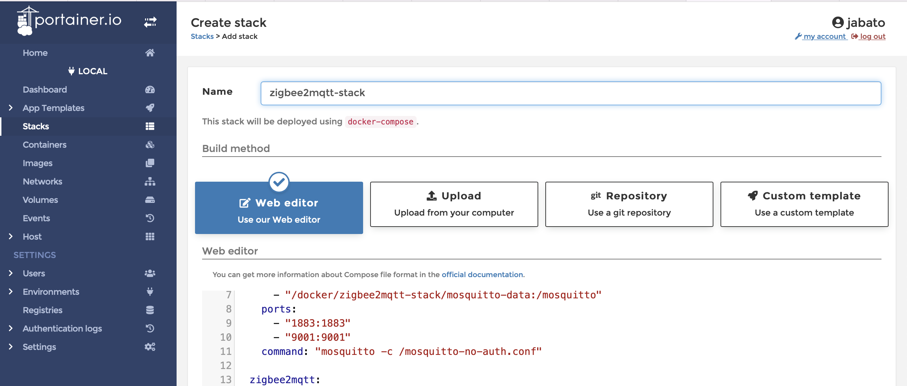

# Open Source Smart Home - Raspberry Pi, Home Assistant, Zigbee

In this tutorial, we will be  setting up a Smart Home in my Raspberry Pi, following the best practices.

This will let us do home automations, like turning on/off lights depending on some scenarios. We will also have dashboards to visualize parameters like temperature, humidity, etc.

We will be migrating my previous home-assistant configuration into a new SD card with the Raspberry Operating System updated, following the best practices for security, usability and maintainability. 
This previous system is outdated, and I did not take notes on the configurations and stepsdone, this is why this tutorial was made: I need to be able to maintain and upgrade the system easily in the future.

## Hardware needed
### Raspberry Pi Model 3B+  

  
[https://www.raspberrypi.com/products/raspberry-pi-3-model-b-plus/](https://www.raspberrypi.com/products/raspberry-pi-3-model-b-plus/) 

*The Raspberry Pi is a low cost, credit-card sized computer that plugs into a computer monitor or TV, and uses a standard keyboard and mouse. It is a capable little device that enables people of all ages to explore computing, and to learn how to program in languages like Scratch and Python. It’s capable of doing everything you’d expect a desktop computer to do, from browsing the internet and playing high-definition video, to making spreadsheets, word-processing, and playing games.*  

*What’s more, the Raspberry Pi  has the ability to interact with the outside world, and has been used in a wide array of digital maker projects, from music machines and parent detectors to weather stations and tweeting birdhouses with infra-red cameras. We want to see the Raspberry Pi being used by kids all over the world to learn to program and understand how computers work.*

### MicroSD Card
  

Here, the Operating System and configuration files will be stored.

Following [home assistant recommendations](https://www.home-assistant.io/installation/raspberrypi/) we will be using SanDisk Extreme - Memory Card microSDXC 64 GB, A2, Class 10, U3, V30. 


### SONOFF Zigbee 3.0 USB Dongle  
  
[https://sonoff.tech/product/diy-smart-switch/sonoff-zigbee-dongle-plus-efr32mg21/](https://sonoff.tech/product/diy-smart-switch/sonoff-zigbee-dongle-plus-efr32mg21/)

*SONOFF Zigbee 3.0 USB Dongle is a universal Zigbee USB stick. It can be used as a universal Zigbee gateway in Home Assistant or other open-source platforms via ZHA or Zigbee2MQTT to locally control all your Zigbee sub-devices, so you don’t need to invest on the Zigbee hubs for different brands, all you need is a universal gateway – Dongle Plus!*

#### About Zigbee
  

*Zigbee is an IEEE 802.15.4-based specification for a suite of high-level communication protocols used to create personal area networks with small, low-power digital radios, such as for home automation, medical device data collection, and other low-power low-bandwidth needs, designed for small scale projects which need wireless connection. Hence, Zigbee is a low-power, low data rate, and close proximity (i.e., personal area) wireless ad hoc network.*  

*Its low power consumption limits transmission distances to 10–100 meters line-of-sight, depending on power output and environmental characteristics.[1] Zigbee devices can transmit data over long distances by passing data through a mesh network of intermediate devices to reach more distant ones. Zigbee is typically used in low data rate applications that require long battery life and secure networking. (Zigbee networks are secured by 128 bit symmetric encryption keys.) Zigbee has a defined rate of 250 kbit/s, best suited for intermittent data transmissions from a sensor or input device.*

## Setting up
### Back up
I did back up our old files from the raspberry to my mac.
The old raspberry hostname is cacharrito01, spanish for "little_gadget_01".

Mounting root "/" from raspberry into `$HOME/cacharrito01` on my mac:

```console
ssh_port="6996"
rpi_name_short="cacharrito01"
rpi_name="${rpi_name_short}.local"
sudo sshfs -p "${ssh_port}" \
           -o allow_other,defer_permissions \
           "jabato@${rpi_name}":/ \
           "${HOME}/${rpi_name_short}"
```

After mounting, we use [FreeFileSync Donation Edition](https://freefilesync.org/) to copy files locally.
  

```console
# Show mounted files:
mount
# Umounting:
sudo umount "$HOME/cacharrito01"
```

### Install Operating System

* Mount MicroSD card on the computer
* Install Raspberry Pi Imager `brew install --cask raspberry-pi-imager`
* `open "/Applications/Raspberry Pi Imager.app"`


* Insert the SD card into Raspberry Pi SD Card Reader
* Plug USBKeyboard/Mouse and Zigbee Dongle(In my case, wireless)
* (I also connected the HDMI port to my screen to check everything went OK)
* (Keep the eth0 port disconnected so wifi can be set on first boot).
* Turn it on!


* `ssh jabato@cacharrito02.local`

```bash
# Raspberry
sudo apt update
sudo apt full-upgrade
cat /proc/cpuinfo | grep Model
#Model		: Raspberry Pi 3 Model B Plus Rev 1.3
```
## [Security Tips](https://raspberrytips.com/security-tips-raspberry-pi/)

1. Keep your system updated
```bash
# Raspberry
sudo apt install unattended-upgrades 
sudo apt install -y vim
# sudo vim /etc/apt/apt.conf.d/50unattended-upgrades
# Set to receive local user root mail upgrades:
# Unattended-Upgrade::Mail "root";
```
For dev purposes I will mount it's filesystem:

```bash
# Local terminal:
rpi_name_short="cacharrito02"
rpi_name="${rpi_name_short}.local"
sudo sshfs -p "${ssh_port}" \
           -o allow_other,defer_permissions \
           "jabato@${rpi_name}":/ \
           "${HOME}/${rpi_name_short}"
# Open finder here           
open /Users/jaimebarez/cacharrito02
```

And update bash history file in realtime to copy paste commands to this README file:

```bash
# Raspberry
shopt -s histappend
PROMPT_COMMAND="history -a;$PROMPT_COMMAND"
```

```bash
# Raspberry
sudo vim /etc/apt/apt.conf.d/02periodic
# This will enable an automatic update every day.
# We ask apt to make: update, download upgrades, install upgrades, and auto-clean every day.
# The last line is the verbose level you’ll get in the /var/log/unattended-upgrades and email (1= low, 3=max).
# This should be ok, you can debug your configuration with this command:
sudo apt install mailutils -y
sudo unattended-upgrades -d
```

2. Make sudo require a password

```bash
# Raspberry
sudo nano /etc/sudoers.d/010_pi-nopasswd
# jabato ALL=(ALL) PASSWD: ALL
```

3. SSH: Prevent root login
```bash
# Raspberry
sudo vim  /etc/ssh/sshd_config
# Must have commented line:
# #PermitRootLogin prohibit-password
```

4.  SSH: Change the default port

```bash
# Raspberry
# The SSH default port is 22.
# So basically, attackers will create bots to make login attempts on this port.
# To prevent this, you can change the default port and set another one:
sudo vim /etc/ssh/sshd_config
# Port 6996
sudo service ssh restart
```

```bash
# Local terminal:
ssh -p 6996 jabato@cacharrito02.local
```

5. Use id_rsa

```bash
# Local terminal
ssh-keygen -t rsa -f ~/.ssh/cacharrito02_rsa -b 2048	
# Enter file in which to save the key (/Users/jaimebarez/.ssh/id_rsa): ~/.ssh/cacharrito02_rsa

ssh-copy-id -p 6996 -i ~/.ssh/cacharrito02_rsa jabato@cacharrito02.local
```

```bash
# Raspberry
sudo vim /etc/ssh/sshd_config
# Find the following lines and change them as follows,
# PermitRootLogin no
# PasswordAuthentication no
# ChallengeResponseAuthentication no
# UsePAM no

sudo systemctl reload sshd
```

```bash
# Local terminal
ssh -p '6996' 'jabato@cacharrito02.local' -i $HOME/.ssh/cacharrito02_rsa

# This is OK:
# ➜  ~ ssh -p '6996' 'root@cacharrito02.local' -i $HOME/.ssh/cacharrito02_rsa
# root@cacharrito02.local: Permission denied (publickey).
# ➜  ~ ssh -p '6996' 'jabato@cacharrito02.local' -i $HOME/.ssh/cacharrito02_rsa  -o PubKeyAuthentication=no
# jabato@cacharrito02.local: Permission denied (publickey).
```

6. Install Fail2ban

   **Fail2ban is a tool** that detects brute-force attacks and blocks them.
   In the previous steps, I said that an attacker could try to find your password for months, and maybe they can succeed.
   The main purpose of Fail2ban is to avoid this.

   Fail2ban will block attackers’ IP if they fail to log in more than X times.
   You can configure the number of tries before a ban, and the ban duration.
   Follow these steps to install Fail2ban on your Raspberry Pi:

```bash
#Raspberry
sudo apt install fail2ban -y
```

- By default, fail2ban will ban attacker 10 min after 5 failures.
  I think it’s ok to start, but if you want to change this, all the configuration is in the /etc/fail2ban folder.
  Mainly in /etc/fail2ban/jail.conf:
  `sudo nano /etc/fail2ban/jail.conf`
- Restart the service if you change anything:
  `sudo service fail2ban restart`

7. Install a firewall

   As explained in this in-depth article, [an antivirus is not mandatory on Raspberry Pi](https://raspberrytips.com/raspberry-pi-antivirus/), and Linux in general, but a firewall is a good practice if you host some critical services on it.

   I’m used to installing iptables for my firewall rules, but maybe for a beginner, it’s not the easiest route to take. So, I’ll explain to you how to install ufw (**U**ncomplicated **F**ire**W**all), which is more straightforward, and then allow only what you need.

   It’s a basic configuration with HTTP access for anyone, and SSH only for you, but you need to adapt this to what you want to do.

   - Install the firewall package:
      `sudo apt install ufw -y`

   - Allow ssh

     `sudo ufw allow 6996 `

     or to ip address only:

     `# Example: sudo ufw allow from 192.168.1.100 port 6996`

   - (Example:) Allow Apache access for anyone:
     `# sudo ufw allow 80`

     `# sudo ufw allow 443`

   - (Example:) Allow SSH access for your IP address only** (not mandatory, just to give you another example):
     `# sudo ufw allow from 192.168.1.100 port 6996`
     On a local network, you can get your IP address with ipconfig (Windows) or ifconfig (Linux/Mac).

   - Enable the firewall:
     `sudo ufw enable`

     Be careful, this will enable the firewall now, and also on boot.
     If you lose access to your device, you won’t be able to fix this, even after a reboot.
     You’ll need to change the configuration directly on the Raspberry Pi (physically).

   - Check that everything is fine.

   https://www.digitalocean.com/community/tutorials/como-configurar-un-firewall-con-ufw-en-ubuntu-18-04-es

8. Protect physical access

   The last protection is obvious but often ignored when we talk about security.
   You can configure any security protocols, firewall, and VPN from all the steps before.
   If your Raspberry Pi is physically accessible by anyone, it’s useless.

   Make sure that the Raspberry Pi can’t be stolen easily (or the SD card), and that nobody could come and plug a keyboard and screen and be logged in automatically.  

   The steps to implement to protect that kind of attack will depend on your system.  

   Maybe you’ll need an auto logoff after X minutes, a password in the grub boot menu, or encrypt the data on the SD card.  


   Think about it, what could be the worst thing that could happen if someone gets access physically to your Raspberry Pi? Then find solutions to prevent this from happening.

9. Check your logs regularly
    The last two items from this list are not really protections, but more of a commitment to follow.
    Most of the time, attacks are visible in the log files.
    So, try to read them regularly to detect any suspicious activity. 

  All logs are in the /var/log folder, but the main log files to check are:

  /var/log/syslog: main log file for all services.
  /var/log/message: whole systems log file.
  /var/log/auth.log: all authentication attempts are logged here.

  /var/log/mail.log: if you have a mail server, you’ll find a trace of recent emails sent here.
  Any critical applications log file, for example /var/log/apache2/error.log or /var/log/mysql/error.log

## Install docker

```bash
# Raspberry
curl -fsSL https://get.docker.com -o get-docker.sh
sudo sh get-docker.sh

# 'sudo systemctl start docker' if error on 'sudo docker ps'

# Automatic loading service at startup:
sudo systemctl enable docker.service
sudo systemctl enable containerd.service
# Test with 'systemctl status docker.service'
sudo docker run hello-world

# All OK:
sudo ufw status
sudo service fail2ban status

# Speer tests and ip config
```

```bash
# Raspberry
# Some commands:
sudo iwlist wlan0 scan | grep ESSID
sudo vim /etc/wpa_supplicant/wpa_supplicant.conf 
ifconfig wlan0
iwgetid

# DNS
cat /etc/resolv.conf
# Speed test
sudo apt install speedtest-cli
speedtest

ip r | grep default
# Set manual IP for later port forwarding in router:
sudo vim /etc/dhcpcd.conf
```

(By the way, now to mount:)

```bash
# Local terminal
ssh_port="6996"
rpi_name_short="cacharrito02"
rpi_name="${rpi_name_short}.local"
sudo sshfs -p "${ssh_port}" \
           -o allow_other,defer_permissions \
           -o IdentityFile=$HOME/.ssh/cacharrito02_rsa \
           "jabato@${rpi_name}":/ \
           "${HOME}/${rpi_name_short}"

```

```bash
# Raspberry
sudo vim /etc/dhcpcd.conf
# interface wlan0
# static ip_address=192.168.1.202/24
# static routers=192.168.1.1
# static domain_name_servers=192.168.1.1 80.58.61.254 80.58.61.250 9.9.9.9 1.1.1.1 8.8.8.8
sudo reboot
ip r | grep default
cat /etc/resolv.conf


# Install Portainer
sudo mkdir -p /docker/portainer
sudo tee /docker/portainer/docker-compose.yml <<EOF
version: '3.3'
services:
    portainer-ce:
        ports:
            - '9443:9443'
        container_name: portainer
        restart: always
        volumes:
            - '/var/run/docker.sock:/var/run/docker.sock'
            - '/docker/portainer/data:/data'
        image: 'portainer/portainer-ce:latest'
        command: '--http-disabled'

EOF

# For the moment:
sudo ufw allow 9443
sudo ufw allow 8000
sudo ufw allow 9000
sudo ufw delete allow 8000
sudo ufw delete allow 9000

sudo docker compose -f /docker/portainer/docker-compose.yml up --detach
# sudo docker compose -f /docker/portainer/docker-compose.yml dow
# TODO self signed certificate HTTPS
# openssl req -x509 -newkey rsa:4096 -keyout key.pem -out cert.pem -sha256 -days 365
# https://it-infrastructure.solutions/deploying-portainer/


# TODO 
# portainer  | time="2022-08-27T14:29:30Z" level=info msg="Encryption key file `portainer` not present"
# portainer  | time="2022-08-27T14:29:30Z" level=info msg="Proceeding without encryption key"
```

Web browser to: https://cacharrito02.local:9443/

# What is Portainer?

[Portainer](https://github.com/portainer/portainer) is a lightweight management UI that allows you to easily manage your different Docker environments.

Portainer provides an easy and simple solution for managing Docker containers and Swarm services through a web interface. Portainer supports a wide range of features for managing the Docker containers, such as managing the creation and deletion of Swarm services, user authentication, authorizations, connecting, executing commands in the console of running containers, and viewing containers’ logs.

https://cacharrito02.local:9443


HTTPS only forcing (Apply Changes):


(DIsable anonymous collection of statistics)

Portainer SSL Certificate

# sudo ufw disable # For disabling


## Install eclipse-mosquitto and zigbee2mqtt


Eclipse Mosquitto is an open source (EPL/EDL licensed) message broker that implements the MQTT protocol versions 5.0, 3.1.1 and 3.1. Mosquitto is lightweight and is suitable for use on all devices from low power single board computers to full servers.

The MQTT protocol provides a lightweight method of carrying out messaging using a publish/subscribe model. This makes it suitable for Internet of Things messaging such as with low power sensors or mobile devices such as phones, embedded computers or microcontrollers.


```bash

# Check existence/dev/serial/by-id/usb-Silicon_Labs_CP2102N_USB_to_UART_Bridge_Controller_d46b031fef93eb118121a75b3d98b6d1-if00-port0

sudo mkdir -p /docker/zigbee2mqtt-stack
```
Copy:

 sudo cp -R /home/jabato/delete/zigbee2mqtt/ /docker/zigbee2mqtt-stack

```yml
version: '2'
services:
  mqtt:
    container_name: mosquitto
    image: eclipse-mosquitto:latest
    restart: unless-stopped
    volumes:
      - "/docker/zigbee2mqtt-stack/mosquitto-data:/mosquitto/data"
      - "/docker/zigbee2mqtt-stack/mosquitto-log:/mosquitto/log"
    ports:
      - "1883:1883"
      - "9001:9001"
    command: "mosquitto -c /mosquitto-no-auth.conf"

  zigbee2mqtt:
    container_name: zigbee2mqtt
    restart: always
    image: koenkk/zigbee2mqtt
    volumes:
      - /docker/zigbee2mqtt-stack/zigbee2mqtt-data:/app/data
      - /run/udev:/run/udev:ro
    ports:
      - 8080:8080
    environment:
      - TZ=Europe/Madrid
    group_add:
      - dialout
    devices:
      - /dev/serial/by-id/usb-Silicon_Labs_CP2102N_USB_to_UART_Bridge_Controller_d46b031fef93eb118121a75b3d98b6d1-if00-port0:/dev/ttyUSB0

```



Create stack

`sudo ufw allow 8080`


Receiving humidity, buttons...


https://www.zigbee2mqtt.io/guide/getting-started/#prerequisites


